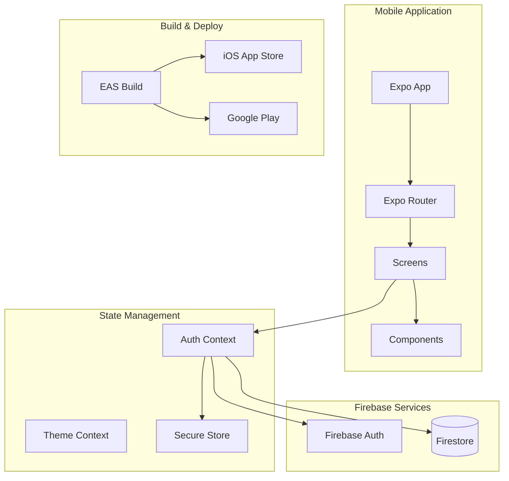
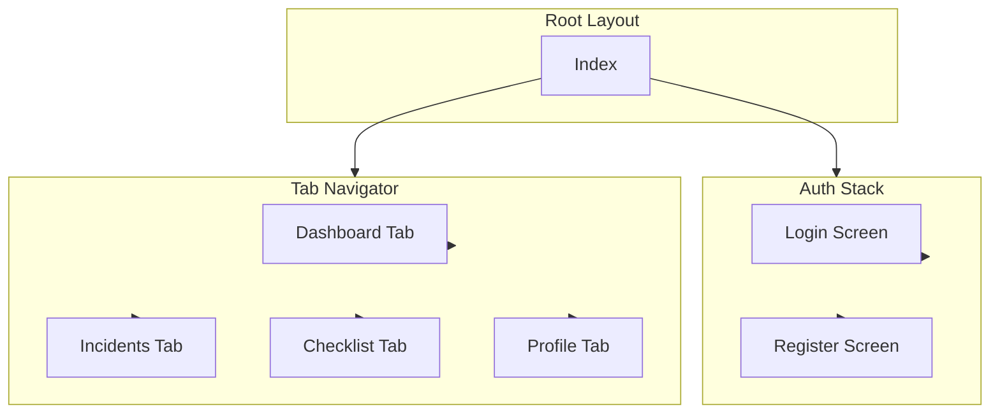
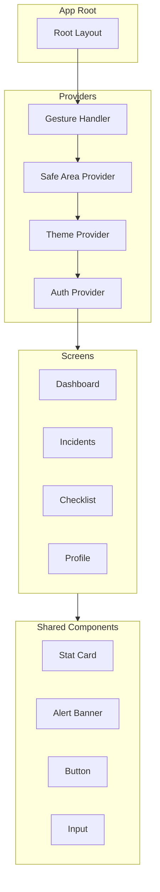
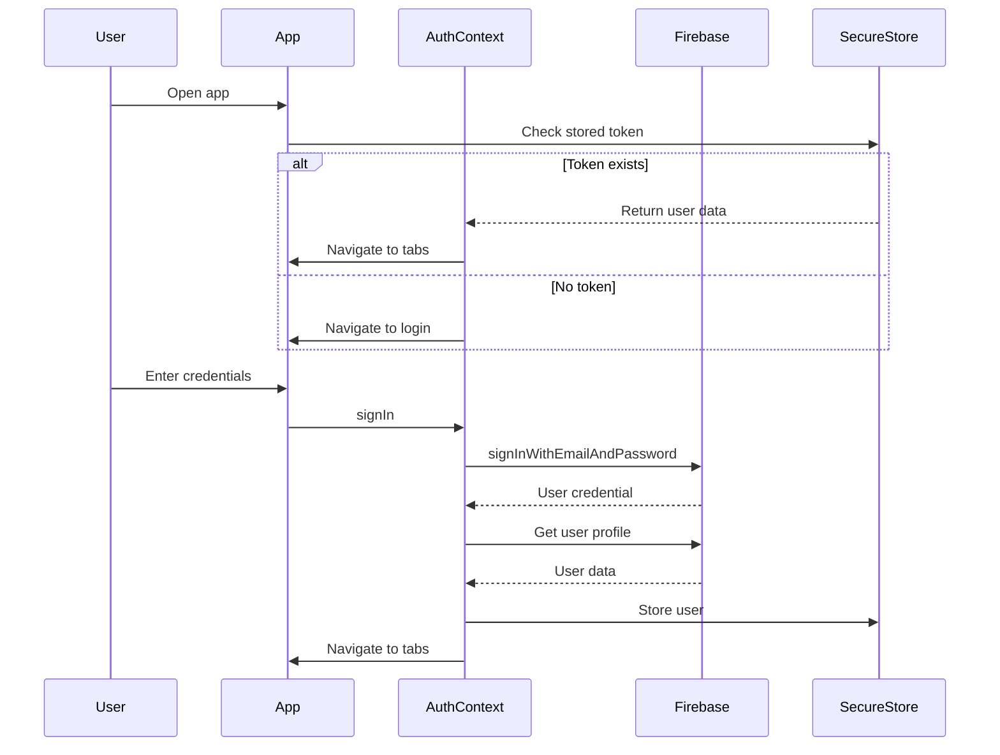
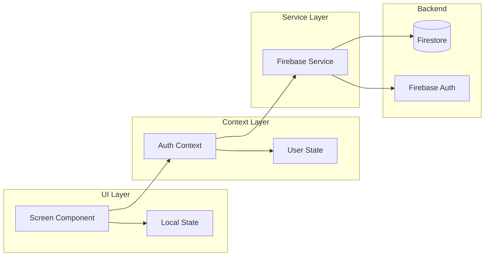
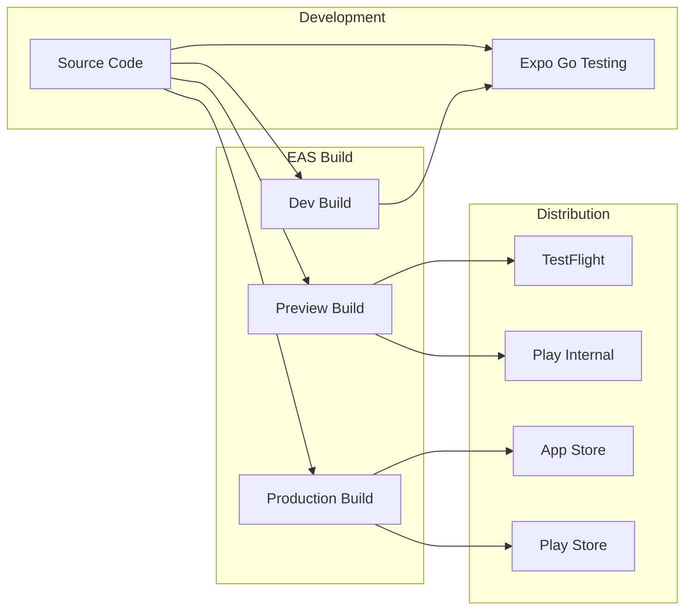
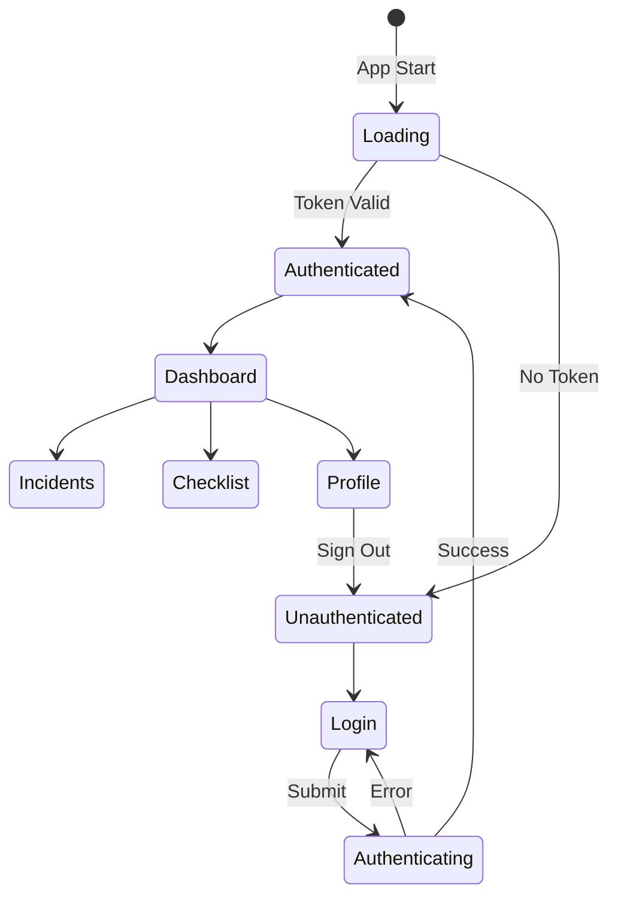

# EIO4 Mobile - Architecture Documentation

## CSIR EOI 8119 - Mining Safety Mobile App

### System Architecture

### Navigation Structure

### Component Hierarchy

### Authentication Flow

### Data Flow

### Build & Deploy Pipeline

### Screen State Management

